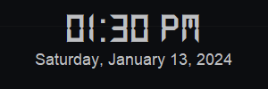

# Floating Clock



Create a beautiful floating clock in Kotlin using Swing. This minimalistic clock application provides a sleek, customizable, and draggable interface.

## Features

- Draggable interface
- Customizable fonts
- Always on top
- Double-click to close

## Prerequisites

- [Java](https://www.java.com/) installed on your system

## Getting Started

1. Clone the repository:

   ```bash

   git clone https://github.com/your-username/floating-clock.git

   ```
2. Compile and run the application:

   ```bash

   cd floating-clock

   kotlinc FloatingClock.kt -include-runtime -d FloatingClock.jar

   java -jar FloatingClock.jar

   ```

## Customization

- Replace `assets/icon/launcher-icon.png` with your own launcher icon.
- Customize the font by replacing `assets/font/Ds-Digit.ttf` with your desired TTF font.
